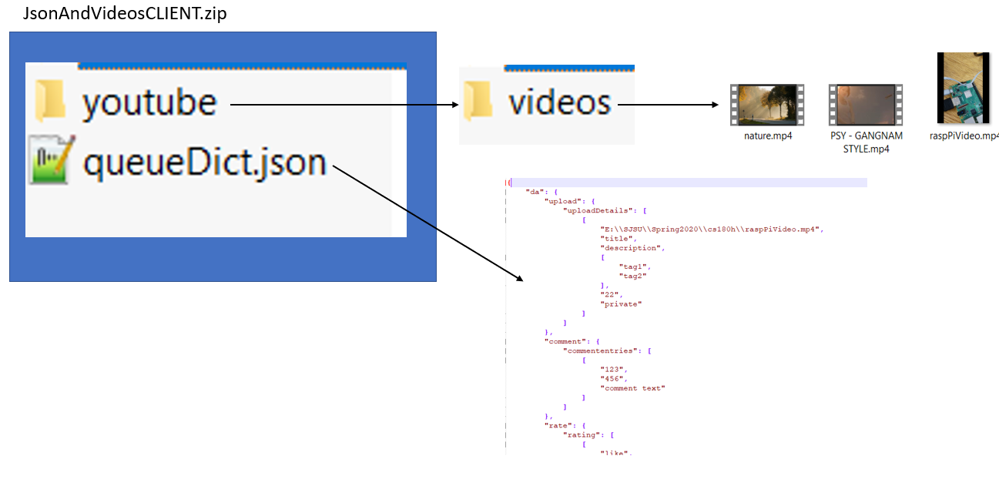
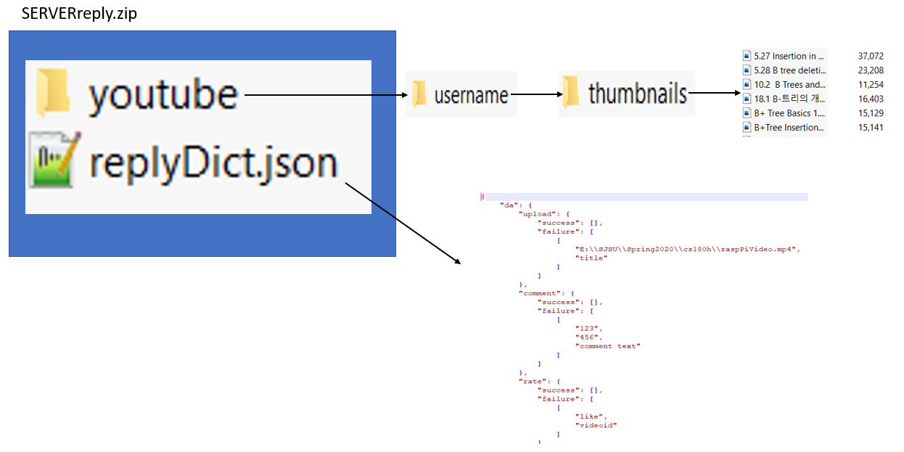

# disconnectedNetworksYT
cs 180h senior project by Dylan Ceronio

# Project Explanation

The project is setup as a server and client. 
The client queues the actions the user would like to take in a zipped JSON file along with the .mp3's of videos they would also like to upload.
The server will read the JSON full of actions and service each action.
It will create a zip that is full of confirmations for each actions, video search information, and thumnails.

## pip install list
- pytube
- click
- google-api-python-client


## Diagrams




## Google Project Setup
Since the project uses the youtube data api we will need a api key. 
This is retrieved through [Google Dev Website](console.developers.google.com) where you can create a project. 
After, you have to say what API the project will use. 
In this case search for the youtube data API and enable it.

Then in your project on the APIs and Services Youtube Data API page click on credentials in the side tab. 
There at the top of the page you can click create credentials and API Key.
An API Key is generated and this can be used in the server program where you build a youtube object.

For using function's like rating a video or commenting a Client Secret file is needed due to the function acting on the behalf of a user. 
On the credentials tab click create credentials and OAuth client ID. 
You can give it a name and then download it as a JSON. 
These types of functions will request user consent, this is down through the terminal when using the program. 
It will take the user to a google OAuth where they can allow the program to make changes and access to their information.
A string will then be generated that can be pasted in the terminal and the program will continue. 

## Client
The cmdp.py file in the clientcommandline folder is a commandline interface that will act as a client.
The User will type individual commands and provide arguments that satisfy that specific command.
The client will then record the command and arguments for the user in **queueDict.json**

The user can type `python cmdp.py --help` for options.
 
The Youtube username is taken at the begginning of the program so that actions for multiple users can be recorded.

Actions that can be taken:
```
  comment    Queues a comment a user would like to leave on a video.
  download   Uses PyTube to download a given videoid.
  rate       Queues what a user would rate a video.
  search     Queues what a user wants to search.
  subscribe  Queues a channel a user wants to subscribe to.
  upload     Queues a video the user wants uploaded, stores as list of...


COMMENT

Usage: cmdp.py comment [OPTIONS] VIDEOID CHANNELID COMMENTTEXT

  Queues a comment a user would like to leave on a video. Stores in JSON as
  List of Lists

  videoid: id of the video.

  channelid: id of the channel.

  commenttext: text of the comment the user would like to leave.

DOWNLOAD

Usage: cmdp.py download [OPTIONS] VIDEOID OUTPUTPATH

  Uses PyTube to download a given videoid.

  videoid: id of a youtube vidoe obtained from serverReply.zip search
  section

  outputpath: Where you would like the video to be saved to

RATE

Usage: cmdp.py rate [OPTIONS] RATING VIDEOID

  Queues what a user would rate a video. Stores in Json as list of lists.

  rating: if a user rates like, dislike, or neutral (unlike/dislike).

  videoid: id of the video you want to rate, found in SERVERreply for search

SEARCH

Usage: cmdp.py search [OPTIONS] QUERY RESULTNUMBER

  Queues what a user wants to search. Stores in JSON as a list of lists.

  query: What the user wants searched.

  resultnumber: Number of results the user would like.

SUBSCRIBE

Usage: cmdp.py subscribe [OPTIONS] CHANNELID

  Queues a channel a user wants to subscribe to. Stores in JSON as list of
  strings.

  channelname: Name of the channel the user wants to subscribe to.

UPLOAD

Usage: cmdp.py upload [OPTIONS] VIDEOPATH TITLE DESCRIPTION TAGS CATEGORY
                      PRIVACYSTATUS

  Queues a video the user wants uploaded, stores as list of lists.

  file: File path to the video to upload

  title: Title of the video.

  description: Description for the video.

  tags: Python List of words associated with the video when searched.

  category: The category ID for the YouTube video category associated with
  the video.

  privacystatus: The privacy status of the video, 'private', 'public',
  'unlisted'.
```
Download is the only function that does not get recorded in queueDict.json as no data is being passed to the server.

An example of a filled out queueDict.json would look like:
```
{
    "firstUser": {
        "upload": {
            "uploadDetails": [
                [
                    "E:\\SJSU\\Spring2020\\cs180h\\raspPiVideo.mp4",
                    "title",
                    "description",
                    [
                        "tag1",
                        "tag2"
                    ],
                    "22",
                    "private"
                ]
            ]
        },
        "comment": {
            "commententries": [
                [
                    "123",
                    "456",
                    "comment text"
                ]
            ]
        },
        "rate": {
            "rating": [
                [
                    "like",
                    "videoid"
                ]
            ]
        },
        "search": {
            "query": [
                [
                    "search text",
                    "5"
                ]
            ]
        },
        "subscribe": {
            "channelname": [
                "channelid"
            ]
        }
    },
    "SecondUser": {
        "subscribe": {
            "channelname": [
                "channelid"
            ]
        }
    }
}

```
The file uses the [click api](https://click.palletsprojects.com/en/7.x/) to help with the command line interface. 
The main function is a click group and each function that is ment to be called on the command line is a click command of the main click group. 
This provides the easy help functionality and each function can be called directly from thte command line.

There is a listParamType that I created for click since the search command requires a list of tags.
With this custom type you can enter `'[tag1,tag2]'` into the command line and it will be accepted and parsed correctly.

There is a ctx parameter that is also passed around.
This is built into click and acts as a dictionary of what username, the queue dictionary, and current cmd to each function.
If a function uses the ctx parameter it has a pass_context click decorator on it as well.

Going through the program it starts in main.
Here the JsonAndVideos.zip is opened and the queueDict.json is read.
If the queueDict.json file is empty a empty dictionary will be used
If either the or the json don't exist a zip will be created with a empty dictionary.

Next the corresponding command that was typed will be executed.
Most of the functions are the same in structure.
If there is a empty dictionary an entry for the user will be created with the command and arguments recorded.
If there is a dictionary but no user entry, the user and comamand and arguments will be recorded.
if there is a dictionary, user but not the specific command section, that section will be recorded with the needed arguments.
Finally if the dictionary, user, and command section exist the entry will be updated.
All the entries are lists of lists, so the new one can just be appended.
For upload, a new entry will not be made if it already exists.

At the end of each function there is a call to the updateJson function.
This function updates the JSON file and makes the JsonAndVideos.zip.
First it will open the queueDict.json file and write the updated dictionary.
This is done using the JSON library, dumps() will make a python dictionary a JSON string, and loads() will make a JSON string a python dictionary.
It is also used in the main function.
Then the youtube/videos folder in the zip will be extracted to the current directory into the oldVideos folder.
This is done for debugging and for the next step.
That being the zip file will be recreated.
Each video that needs to be uploaded will be found and zipped.
This is done using Shutil.copyfileobj().
The function takes a file descriptor for a video and a file descriptor for a location in the zip.
The video will then be copied over to the zip file.
If the video cannot be found again, the program will use the video in the oldVideos folder.

## Server

In the server file we start with the main function and retrieve the api key.
The api key should be made an environment variable and that is explained [here](https://www.youtube.com/watch?v=IolxqkL7cD8).
Then two different youtube objects are built with the build function from youtube.
One is for seraching and uses the api_key from your environment variables.
The other uses the credentials variable.
This code is at the top of the file:

```
CLIENT_SECRET_FILE = 'client_secret_file.json'
SCOPES = ['https://www.googleapis.com/auth/youtube.force-ssl']
flow = InstalledAppFlow.from_client_secrets_file(CLIENT_SECRET_FILE, SCOPES)
credentials = flow.run_console()
```

The client secret file is the one downloaded from the created google project.
The scope is the [access scope](https://developers.google.com/youtube/v3/guides/auth/installed-apps) the program will use for google OAuth.
The flow receives both the secret file and the scope, the line `flow.run_console()` will generate a url in the terminal and ask for user consent.
Follow the steps and a string will be generated by OAuth that can be copy pasted into the terminal.
The Program will then run.

The JsonAndVideos.zip will be opened and the queueDict.Json file will be read and loaded into a python dictionary using the JSON library.
After each request in the dictionary will be serviced by looping through all the keys().

If the entry is a comment, two lists are made for successful and failed comments made.
The comment function takes the behalfyoutube variable, videoid, channelid, and commenttext.
Using the commentThreads function, it executes the dictionary created in the function.
If the entries are rate or subscribe follow the same format.

If the entry is a search a list is created and each query in queueDict.json is serviced for the user.
The search function will take a single query and create a list.
The list will be populated with dictionaries with the title, description, videoid, channelId, and thumbnailUrl.
After the search for the single query a youtube/<username>/thumbnails directory is created if it doesn't exist.
Here thumbnails from the thumbnailUrls that were searched are downloaded using the urllib.request.urlretrieve function.
The title of the video is used as the name of the file.
The WindowsAdjust function is used here to remove characters `<>:"/\|?*` that windows cannot have in filenames.

If the entry is a upload, the specific video will be extracted from the client zip.
The current working directory is changed and the upload function is called.
Like other functions there is a youtube.videos().insert() function that will upload a video for the user.
The current working directory is changed back and if it was successful the videopath and title are appended to the success list.
If not they are appended to the failure list.

The dictionary will then be dumped into replyDict.json as a json string.
After the SERVERreply.zip is created and the folders with thumbnails will be zipped along with the json file.

Here is an Example of a filled out replyDict.json.
Note that the functions failed becuase they were not given real information.
```
{
    "username": {
        "upload": {
            "success": [],
            "failure": [
                [
                    "E:\\SJSU\\Spring2020\\cs180h\\raspPiVideo.mp4",
                    "title"
                ]
            ]
        },
        "comment": {
            "success": [],
            "failure": [
                [
                    "123",
                    "456",
                    "comment text"
                ]
            ]
        },
        "rate": {
            "success": [],
            "failure": [
                [
                    "like",
                    "videoid"
                ]
            ]
        },
        "search": [
            [
                {
                    "title": "Find Text in String With Excel SEARCH Function",
                    "description": "http://www.contextures.com/30excelfunctionsin30days30xl30d.html The SEARCH function looks for a text string, within another text string. The SEARCH function ...",
                    "videoid": "ooQMVS-acCg",
                    "channelId": "UCNFqyNLJshdysCyj-xeegnA",
                    "thumbnailUrl": "https://i.ytimg.com/vi/ooQMVS-acCg/hqdefault.jpg"
                },
                {
                    "title": "How to Search Text or Contents in Any Files - Windows 10",
                    "description": "This video will show you how you can easily search text or contents in any files in Windows 10. By default windows enable searching for file & folders only.",
                    "videoid": "Iwn5MlZNs8E",
                    "channelId": "UCwNmrAtqCL6cfb3UhS4rDnQ",
                    "thumbnailUrl": "https://i.ytimg.com/vi/Iwn5MlZNs8E/hqdefault.jpg"
                },
                {
                    "title": "Philipp Krenn \u2014 Full-Text Search Explained",
                    "description": "Today's applications are expected to provide powerful full-text search. But how does that work in general and how do I implement it on my site or in my ...",
                    "videoid": "2OY4tE2TrcI",
                    "channelId": "UCYrGYT7BswsJGkmG7-IAF8g",
                    "thumbnailUrl": "https://i.ytimg.com/vi/2OY4tE2TrcI/hqdefault.jpg"
                },
                {
                    "title": "Search Files &amp; Folders by Their Text Contents in Windows 10/8/7",
                    "description": "How to Search Files by Text Contents in Windows PC #FileSearch #SearchByTextContents Facebook Page : https://www.facebook.com/MeMJTube Follow on ...",
                    "videoid": "qEWWtMWIuGU",
                    "channelId": "UCzvmBKjsw19OY5RBauMtVpA",
                    "thumbnailUrl": "https://i.ytimg.com/vi/qEWWtMWIuGU/hqdefault.jpg"
                },
                {
                    "title": "Text search with Lucene (1 of 2)",
                    "description": "Intro to using the Lucene text search library. For other programming videos, including a complete beginner's course, visit http://codeschool.org.",
                    "videoid": "x37B_lCi_gc",
                    "channelId": "UCseUQK4kC3x2x543nHtGpzw",
                    "thumbnailUrl": "https://i.ytimg.com/vi/x37B_lCi_gc/hqdefault.jpg"
                }
            ]
        ],
        "subscribe": {
            "success": [],
            "failure": [
                "channelid"
            ]
        }
    },
    "fds": {
        "subscribe": {
            "success": [],
            "failure": [
                "channelid"
            ]
        }
    }
}
```

# Issues Along the Way

An Issue that occured was right at the beginning of the project.
When I was looking into the youtube data api I wrote some test files and inside one of them I included my API key.
Not thinking anything of it, within a few days I was maxing out my quota for the project even though I had not made any API calls.
My key got stolen.
It was a good lessen in not uploading your files to github with sensitive information.


Another issue I ran into at the end of the project was with Quotas.
This is a system google uses to limit the number of calls a project can make.
Quotas is sort of like a cost system for function calls, [here](https://developers.google.com/youtube/v3/determine_quota_cost) is a calculator.
The limit is 10,000 and normally you wouldn't hit this with a low amount of calls.
For example a search is 100, so you can make 1000 searh calls in a day.
Were the issue came for me was testing uploads.
A single upload is 1600 cost, so I quickly hit the quota limit and was unable to test for the day.
To increase your cap you must go through a review process and may be charged a fee.

# Future of Project

Some future additions to the project that could be done are:
- Automation of client and server
- GUI for client
- Command to upload new videos from subscribed channel from last time you got an update


 


